<!-- Generated by scripts/build-dashboard.mjs. Edits inside the markers are overwritten. -->
<!-- dashboard:start -->

[`POME`](https://github.com/CoderJoeW/POME) · [`LightningTables`](https://github.com/CoderJoeW/LightningTables) · [`Atlas`](https://github.com/CoderJoeW/Atlas) · [`Nitrado-Server-Manager`](https://github.com/CoderJoeW/Nitrado-Server-Manager)

Every panel above is an SVG generated from live GitHub API data by [a workflow in this repo](.github/workflows/dashboard.yml) — no third-party stat services. Last sync 2026-07-17 02:17Z.

<!-- dashboard:end -->
